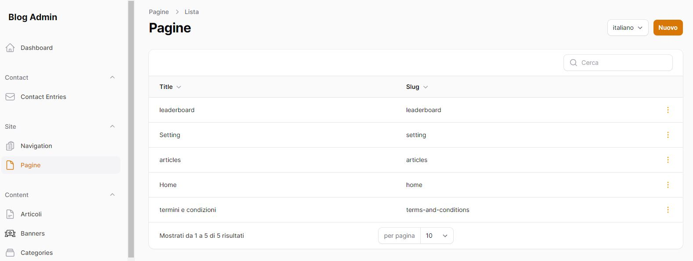
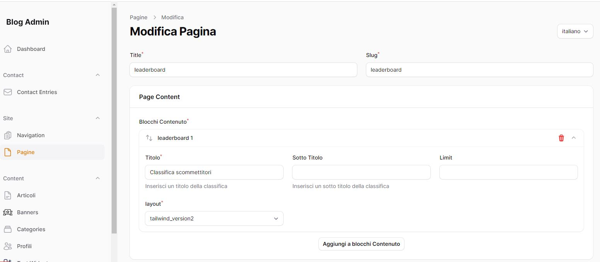

## Gestione delle pagine




Sfruttando le potenzialità di Filament, è possibile gestire le pagine che verranno visualizzate del tema frontend, dando la possibilità di creare e modificare le pagine necessarie per il tuo progetto.

## Contenuti delle pagine, i blocchi

Quando si crea o si modifica una pagina, è possibile determinare il suo contenuto tramite i blocchi del builder,  
oggetti che aiutano a configurare e costruire vari componenti dell'interfaccia utente in modo dichiarativo
Questi blocchi sono spesso utilizzati per strutturare e organizzare il contenuto in modo chiaro e modulare.

I vari blocchi disponibili si possono trovare nella cartella Blocks dei moduli utilizzati.

## Creare una Classe Content

All'interno di un file Resource di Filament, inserire dentro il form

```php
Forms\Components\Section::make('Page Content')->schema([
    PageContent::make('content_blocks')
        ->label('Blocchi Contenuto')
        ->required()
        ->columnSpanFull(),
]),

// oppure

Forms\Components\Section::make('Sidebar Content')->schema([
    LeftSidebarContent::make('sidebar_blocks')
        ->label('Blocchi Sidebar')
        ->columnSpanFull(),
]),


```


per poter poi configurare i blocchi che verranno utilizzati nella pagina.

Ecco un esempio di classe content, in questo caso per determinare il contenuto di una pagina articolo

```php
class ArticleContent
{
    public static function make(
        string $name,
        string $context = 'form',
    ): Builder {
        return Builder::make($name)
            ->blocks([
                Title::make(context: $context),
                Paragraph::make(context: $context),
                ImageSpatie::make(context: $context),
                ImagesGallery::make(context: $context),
                Rating::make(context: $context),
                Chart::make(context: $context),
                // altri tipi di blocchi...
            ])
            ->collapsible();
    }
}
```

## [Esempio di Blocchi](docs/blocks.md)

## Visualizzare i blocchi in una blade

Per visualizzare i blocchi configurati in una blade, viene in aiuto la funzione di ThemeComposer

```php
public function showArticleSidebarContent(string $slug): \Illuminate\Contracts\Support\Renderable
{
    Assert::isInstanceOf($article = Article::firstOrCreate(['slug' => $slug], ['sidebar_blocks' => []]), Article::class, '['.__LINE__.']['.__FILE__.']');
    $article = new \Modules\UI\View\Components\Render\Blocks(blocks: $article->sidebar_blocks, model: $article);
    return $article->render();
}

public function showPageContent(string $slug): \Illuminate\Contracts\Support\Renderable
{
    Assert::isInstanceOf($page = Page::firstOrCreate(['slug' => $slug], ['title' => $slug, 'content_blocks' => []]), Page::class, '['.__LINE__.']['.__FILE__.']');
    $blocks = $page->content_blocks;
    if (! is_array($blocks)) {
        $blocks = [];
    }
    $page = new \Modules\UI\View\Components\Render\Blocks(blocks: $blocks, model: $page);

    return $page->render();
}

public function showPageSidebarContent(string $slug): \Illuminate\Contracts\Support\Renderable
{
    Assert::isInstanceOf($page = Page::firstOrCreate(['slug' => $slug], ['sidebar_blocks' => []]), Page::class, '['.__LINE__.']['.__FILE__.']');

    $page = new \Modules\UI\View\Components\Render\Blocks(blocks: $page->sidebar_blocks, model: $page);

    return $page->render();
}
```